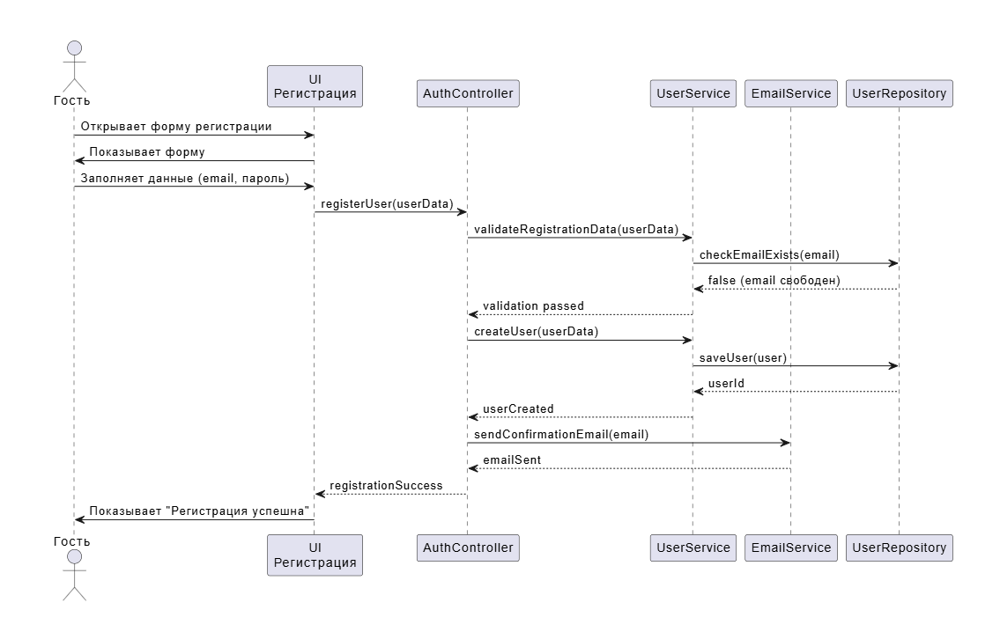
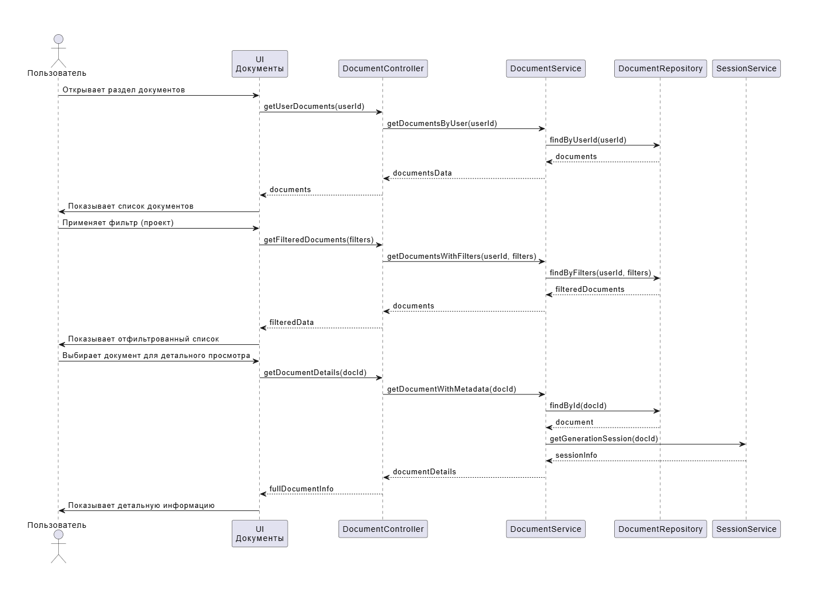

# Диаграммы последовательностей "Document Generation Service"

## Содержание

1. [Регистрация пользователя](#1)
2. [Управление проектами](#2)
3. [Управление шаблонами](#3)
4. [Генерация документа](#4)
5. [Просмотр документов](#5)
6. [Управление сессиями генерации](#6)

### 1. Регистрация пользователя

### 2. Управление проектами

### 3. Управление шаблонами

### 4. Генерация документа

### 5. Просмотр документов

### 6. Управление сессиями генерации

