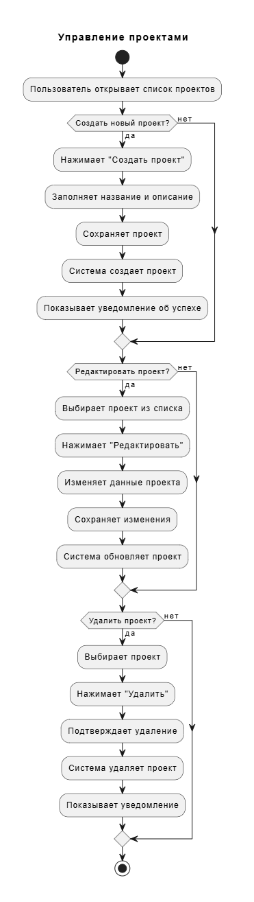
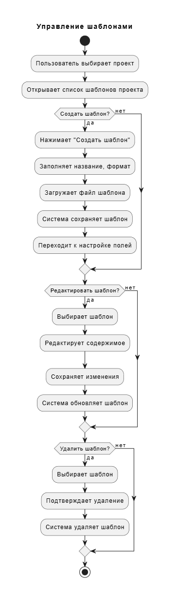
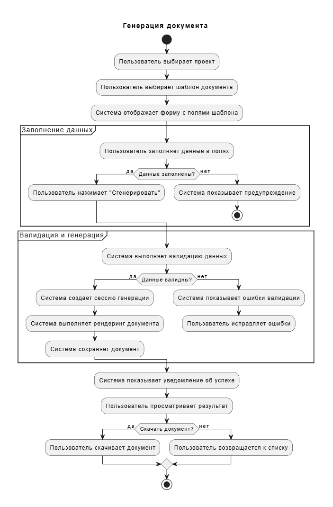
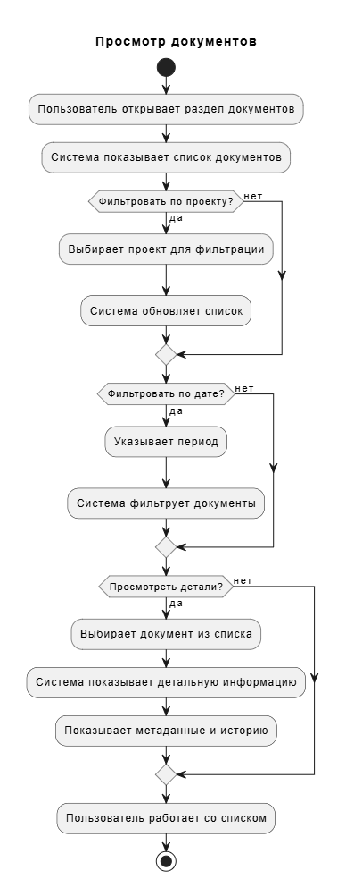

# Диаграммы активностей "Document Generation Service"

## Содержание

1. [Регистрация пользователя](#1)
2. [Управление проектами](#2)
3. [Управление шаблонами](#3)
4. [Генерация документа](#4)
5. [Просмотр документов](#5)
6. [Управление сессиями генерации](#6)

### 1. Регистрация пользователя

**Краткое описание:**
- Гость открывает форму регистрации, заполняет email, пароль и данные
- Система проверяет заполненность полей и уникальность email
- При успехе создается учетная запись, отправляется email подтверждение
- При ошибках показываются соответствующие уведомления

**Основные этапы:**
- Открытие формы регистрации
- Заполнение обязательных полей (email, пароль, данные)
- Валидация данных и проверка уникальности email
- Создание учетной записи или показ ошибок
- Отправка подтверждения и перенаправление на авторизацию

### 2. Управление проектами

**Краткое описание:**
- Пользователь работает со списком проектов: создание, редактирование, удаление
- При создании заполняется название и описание, система сохраняет проект
- Редактирование и удаление требуют подтверждения действий
- Система показывает уведомления о результатах операций

**Основные операции:**
- Просмотр списка проектов
- Создание нового проекта с названием и описанием
- Редактирование существующих проектов
- Удаление проектов с подтверждением
- Получение уведомлений о результате операций

### 3. Управление шаблонами

**Краткое описание:**
- Пользователь выбирает проект и работает с шаблонами в его контексте
- Создание шаблона включает загрузку файла и настройку формата
- Доступны операции редактирования содержимого и удаления шаблонов
- Система сохраняет изменения и управляет жизненным циклом шаблонов

**Ключевые процессы:**
- Выбор проекта для работы с шаблонами
- Создание нового шаблона (название, формат, файл)
- Редактирование содержимого существующих шаблонов
- Удаление шаблонов с подтверждением
- Настройка полей шаблона

### 4. Генерация документа

**Краткое описание:**
- Пользователь выбирает проект и шаблон для генерации
- Заполнение данных в полях формы с валидацией
- При успешной валидации система создает сессию генерации и выполняет рендеринг
- Пользователь может скачать готовый документ или вернуться к списку

**Этапы генерации:**
- Выбор проекта и шаблона документа
- Заполнение данных в полях формы
- Валидация введенных данных
- Создание сессии генерации и рендеринг документа
- Сохранение результата и возможность скачивания

### 5. Просмотр документов

**Краткое описание:**
- Работа со списком документов: фильтрация по проекту и дате
- Просмотр детальной информации с метаданными и историей
- Система динамически обновляет список согласно фильтрам
- Пользователь может детально изучать конкретные документы

**Функциональность:**
- Открытие раздела документов
- Фильтрация по проектам и датам
- Просмотр детальной информации о документах
- Изучение метаданных и истории документов
- Работа с отфильтрованным списком

### 6. Управление сессиями генерации

**Краткое описание:**
- Просмотр истории сессий и детальной информации о статусах
- Анализ ошибок завершенных сессий и принятие решений о повторе
- Возможность отмены выполняющихся сессий с подтверждением
- Система управляет статусами сессий и обработкой команд

**Управление сессиями:**
- Просмотр истории и списка сессий
- Анализ детальной информации о сессиях
- Обработка ошибок и повторная генерация
- Отмена выполняющихся сессий
- Мониторинг статусов сессий