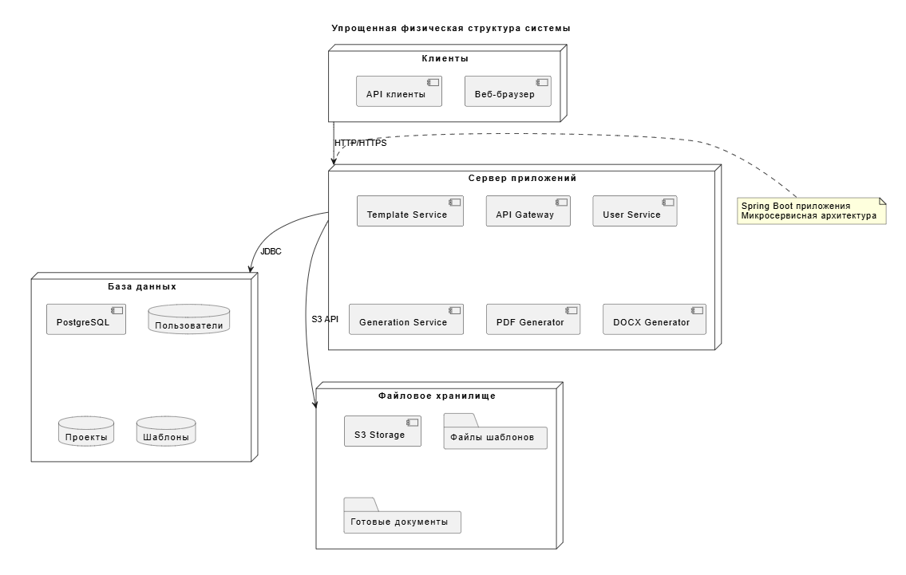

# Диаграмма компонентов и развёртывания — Document Generation Service

## Диаграмма компонентов

**Описание компонентов:**

### Клиентский уровень
* **Веб-браузер** — основной интерфейс пользователя
* **API Клиенты** — внешние системы, интегрирующиеся с сервисом

### Серверный уровень
* **API Gateway** — единая точка входа для всех клиентов, маршрутизация запросов
* **User Service** — управление пользователями, аутентификация и авторизация
* **Template Service** — управление шаблонами документов
* **Generation Service** — оркестрация процесса генерации документов
  * **DOCX Generator** — генерация документов в формате DOCX
  * **PDF Generator** — генерация документов в формате PDF

### Уровень данных
* **PostgreSQL Database** — хранение структурированных данных:
  * Пользователи
  * Проекты  
  * Шаблоны
  * Сессии генерации
* **S3 Storage** — хранение файлов:
  * Файлы шаблонов
  * Готовые документы

## Диаграмма развёртывания

**Описание развёртывания:**

### Клиентский уровень
* **Клиенты** — веб-браузеры и API клиенты
* **Веб-браузер** — доступ через HTTP/HTTPS

### Сервер приложений
* **Spring Boot приложения** — микросервисная архитектура
* **API Gateway** — единая точка входа, балансировка нагрузки
* **User Service** — сервис управления пользователями
* **Template Service** — сервис управления шаблонами
* **Generation Service** — сервис генерации документов
  * **PDF Generator** — компонент генерации PDF
  * **DOCX Generator** — компонент генерации DOCX

### Уровень хранения данных
* **PostgreSQL** — реляционная база данных для:
  * Пользователей
  * Проектов
  * Шаблонов
* **S3 Storage** — объектное хранилище для:
  * Файлов шаблонов
  * Готовых документов
* **S3 API** — интерфейс для работы с файловым хранилищем

**Архитектурные особенности:**
* Микросервисная архитектура на Spring Boot
* Разделение сервисов по бизнес-доменам
* Использование специализированных генераторов для разных форматов
* Масштабируемое объектное хранилище для файлов
* Реляционная база данных для структурированных данных